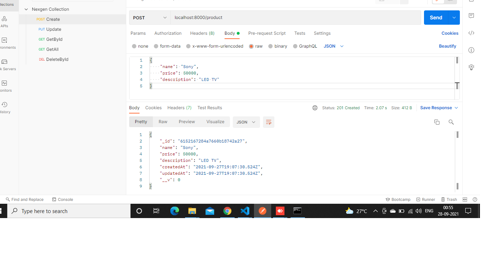
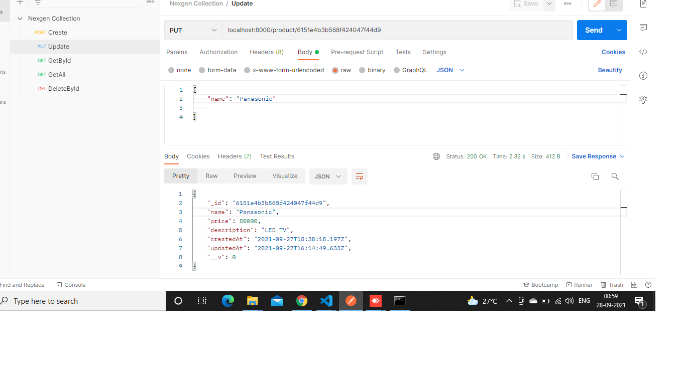
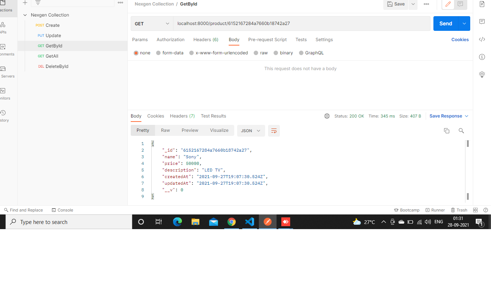
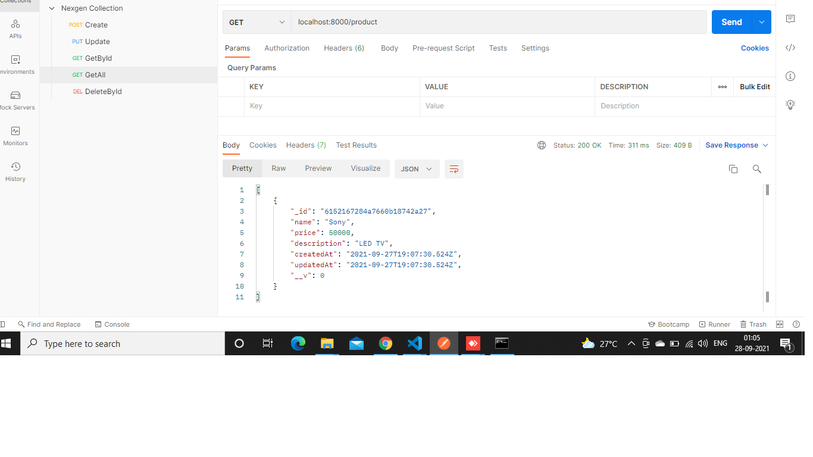
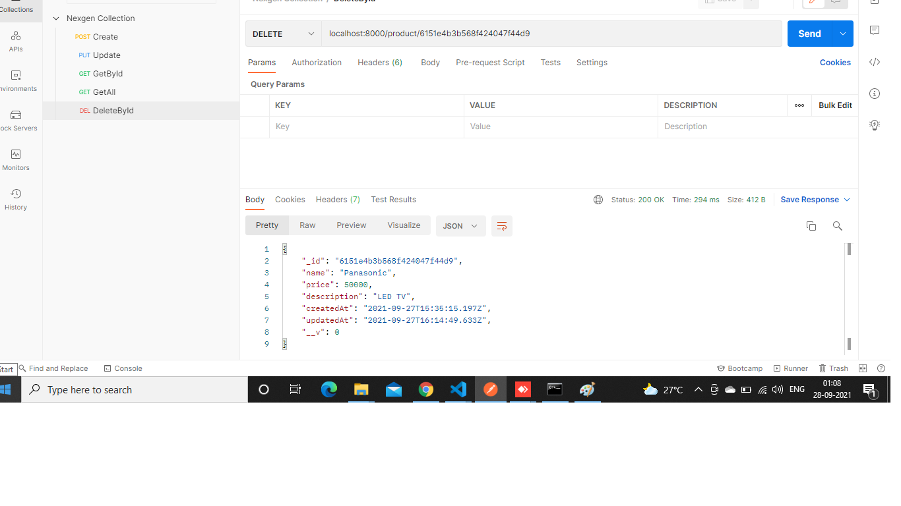

# nexgen

## CREATE PRODUCT
Open [http://localhost:8000/product](http://localhost:8000) with your browser to see the result.

## UPDATE PRODUCT BY ID
Open [http://localhost:8000/product/id](http://localhost:8000) with your browser to see the result.

## GET PRODUCT BY ID
Open [http://localhost:8000/product/id](http://localhost:8000) with your browser to see the result.

## GET  ALL
Open [http://localhost:8000](http://localhost:8000) with your browser to see the result.

## DELETE BY ID
Open [http://localhost:8000/product/id](http://localhost:8000) with your browser to see the result.

